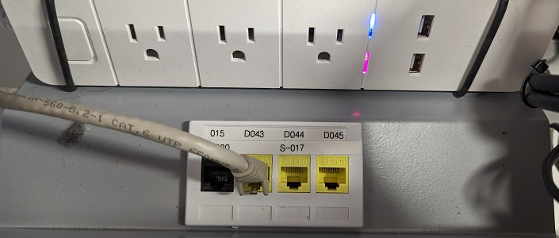
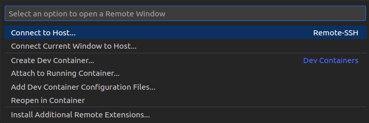
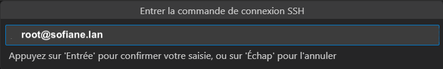
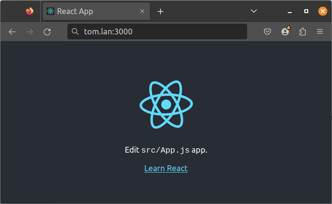

          
  

  

  
  

  <article class="gdoc-markdown gdoc-markdown__align--left">
    <h1>Environnement distant</h1>
    
Dans ce qui suit nous allons configurer VSCode pour qu’il se connecte directement sur un serveur distant utilisé pour le développement. C’est cette configuration qui est utilisée en classe.

    <h2 id="connexion-physique">
        Connexion physique
        <a data-clipboard-text="http://otardi.gitlab.io/420-211/installation/EnvDistant/#connexion-physique" class="gdoc-page__anchor clip flex align-center" title="Anchor to: Connexion physique" aria-label="Anchor to: Connexion physique" href="#connexion-physique">
            <svg class="gdoc-icon gdoc_link"><use xlink:href="#gdoc_link"></use></svg>
        </a>
    </h2>

Afin d’accéder à ce serveur de développement, vous devez vous connecter sur le réseau interne du département.

Après avoir ouvert votre session Windows, modifiez la connexion réseau physique de votre poste de travail comme dans l’image qui suit:

Dans ce réseau, vous avez accès à internet, mais les ressources du Collège sont limitées.

<blockquote class="gdoc-hint note">
  
<i class="fa note" title="Attention"></i>

  
A la fin du cours, n’oubliez pas de rebrancher le câble sur le réseau du Collège!

</blockquote>

    <h2 id="connexion-de-vscode">
        Connexion de VSCode
        <a data-clipboard-text="http://otardi.gitlab.io/420-211/installation/EnvDistant/#connexion-de-vscode" class="gdoc-page__anchor clip flex align-center" title="Anchor to: Connexion de VSCode" aria-label="Anchor to: Connexion de VSCode" href="#connexion-de-vscode">
            <svg class="gdoc-icon gdoc_link"><use xlink:href="#gdoc_link"></use></svg>
        </a>
    </h2>

Votre serveur est identifié par votre prénom suivi du domaine “.lan”, par exemple <em><strong>olivier.lan</strong></em>. L’application <em>React</em> de base et la librairie <em>Bootstrap</em> y sont installées. Pour vous connecter au serveur à partir de <em>VSCode</em> pour la première fois, vous devez créer la connexion comme suit:

Puis choisir <code>+ Add New SSH Host...</code> dans les options disponibles. Entrez ensuite la commande de connexion sur votre serveur. Par exemple pour le serveur <em>olivier.lan</em>, la commande est la suivante:

Puis sélectionnez le fichier de votre choix pour sauvegarder les informations de connexion.

<blockquote class="gdoc-hint note">
  
<i class="fa note" title="Note"></i>

  
Le mot de passe initial est <code>abc-123</code>; il est fortement recommandé de le changer. Pour ce faire utilisez la commande <code>passwd</code> à partir du terminal.

</blockquote>

L’environnement de développement comprend une instalation de <em>NodeJS</em>, <em>Bootstrap</em> et l’application par défaut (“Hello World”) de <em>React</em>.

    <h2 id="démarrage-de-lapplication-react">
        Démarrage de l’application React
        <a data-clipboard-text="http://otardi.gitlab.io/420-211/installation/EnvDistant/#démarrage-de-lapplication-react" class="gdoc-page__anchor clip flex align-center" title="Anchor to: Démarrage de l’application React" aria-label="Anchor to: Démarrage de l’application React" href="#d%c3%a9marrage-de-lapplication-react">
            <svg class="gdoc-icon gdoc_link"><use xlink:href="#gdoc_link"></use></svg>
        </a>
    </h2>

Pour démarrer l’application, faites les comandes suivantes:

<svg class="gdoc-icon copy"><use xlink:href="#gdoc_copy"></use></svg><svg class="gdoc-icon check hidden"><use xlink:href="#gdoc_check"></use></svg><pre tabindex="0" class="chroma"><code class="language-bash" data-lang="bash">cd /var/www
npm start
</code></pre>

<blockquote class="gdoc-hint caution">
  
<i class="fa caution" title="Attention"></i>

  

L’erreur suivante peut survenir lorsque vous faites <code>npm start</code>:

<blockquote>

Error: ENOSPC: System limit for number of file watchers reached

</blockquote>

Si c’est le cas, lancez les commandes suivantes:

> /etc/sysctl.conf
sysctl -p" data-copy-feedback="Copied!" role="button" aria-label="Copy"><svg class="gdoc-icon copy"><use xlink:href="#gdoc_copy"></use></svg><svg class="gdoc-icon check hidden"><use xlink:href="#gdoc_check"></use></svg><pre tabindex="0" class="chroma"><code class="language-bash" data-lang="bash">echo 'fs.inotify.max_user_watches=524288' &gt;&gt; /etc/sysctl.conf
sysctl -p
</code></pre>

</blockquote>

L’application sera visible au port 3000 du serveur; donc si votre serveur se nomme <em><strong>tom.lan</strong></em>, ouvrez une page à l’adresse <a class="gdoc-markdown__link" href="http://tom.lan:3000">http://tom.lan:3000</a>:

  </article>
