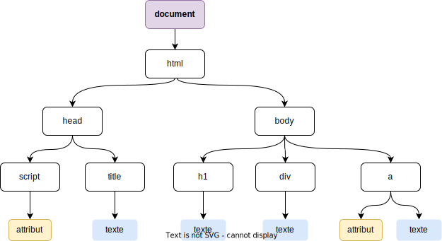

          
  

  

  
  

  <article class="gdoc-markdown gdoc-markdown__align--left">
    <h1>DOM</h1>
    

    <h2 id="structure-dun-document-html">
        Structure d’un document HTML
        <a data-clipboard-text="http://otardi.gitlab.io/420-211/R%C3%A9vision/dom/#structure-dun-document-html" class="gdoc-page__anchor clip flex align-center" title="Anchor to: Structure d’un document HTML" aria-label="Anchor to: Structure d’un document HTML" href="#structure-dun-document-html">
            <svg class="gdoc-icon gdoc_link"><use xlink:href="#gdoc_link"></use></svg>
        </a>
    </h2>

Un document HTML se compose d’éléments organisés comme une hiérarchie ayant la forme d’une arbre inversé. Chaque noeud dans cet arbre correspond à un type d’élément HTML qui peut avoir plusieurs noeuds enfants et au maximum un parent. Seule la <em>racine</em> (le noeud <code>document</code>, au sommet de la hiérarchie) n’a pas de parent.

L’exemple suivant correspond à un <a class="gdoc-markdown__link" href="/420-211/exemple-dom.html">document HTML simple</a>:

<html>
    <head>
        
        <title>Page perso</title>
    </head>
    <body>
        <h1>Bienvenue</h1>
        
Voici du texte

        <a href=&quot;https://www.google.com&quot;>Voici un lien</a>
    </body>
</html>" data-copy-feedback="Copied!" role="button" aria-label="Copy"><svg class="gdoc-icon copy"><use xlink:href="#gdoc_copy"></use></svg><svg class="gdoc-icon check hidden"><use xlink:href="#gdoc_check"></use></svg><pre tabindex="0" class="chroma"><code class="language-html" data-lang="html">&lt;!DOCTYPE html&gt;
&lt;html&gt;
    &lt;head&gt;
        &lt;script src="lib.js"&gt;&lt;/script&gt;
        &lt;title&gt;Page perso&lt;/title&gt;
    &lt;/head&gt;
    &lt;body&gt;
        &lt;h1&gt;Bienvenue&lt;/h1&gt;
        &lt;div&gt;Voici du texte&lt;/div&gt;
        &lt;a href="https://www.google.com"&gt;Voici un lien&lt;/a&gt;
    &lt;/body&gt;
&lt;/html&gt;
</code></pre>

Ce qui correspond au modèle suivant:

    <h2 id="objet-document">
        Objet <code>document</code>
        <a data-clipboard-text="http://otardi.gitlab.io/420-211/R%C3%A9vision/dom/#objet-document" class="gdoc-page__anchor clip flex align-center" title="Anchor to: Objet document" aria-label="Anchor to: Objet document" href="#objet-document">
            <svg class="gdoc-icon gdoc_link"><use xlink:href="#gdoc_link"></use></svg>
        </a>
    </h2>

Javascript comprend un objet nommé <strong>document</strong> qui permet d’accéder aux informations du DOM, de modifier des valeurs d’attributs ou du texte, d’ajouter, de supprimer ou de déplacer des éléments HTML, etc.

L’objet <code>document</code> comprend plusieurs méthodes pour accéder aux éléments du DOM; Parmi celles-ci:

    <h3 id="getelementbyid">
        <code>getElementById()</code>
        <a data-clipboard-text="http://otardi.gitlab.io/420-211/R%C3%A9vision/dom/#getelementbyid" class="gdoc-page__anchor clip flex align-center" title="Anchor to: getElementById()" aria-label="Anchor to: getElementById()" href="#getelementbyid">
            <svg class="gdoc-icon gdoc_link"><use xlink:href="#gdoc_link"></use></svg>
        </a>
    </h3>

Retourne l’élément HTML dont l’attribut <code>id</code> correspond à la valeur passée.

    <h3 id="getelementbytagname">
        <code>getElementByTagName()</code>
        <a data-clipboard-text="http://otardi.gitlab.io/420-211/R%C3%A9vision/dom/#getelementbytagname" class="gdoc-page__anchor clip flex align-center" title="Anchor to: getElementByTagName()" aria-label="Anchor to: getElementByTagName()" href="#getelementbytagname">
            <svg class="gdoc-icon gdoc_link"><use xlink:href="#gdoc_link"></use></svg>
        </a>
    </h3>

Retourne une collection d’éléments HTML dont les noms correspondent à la valeur passée.

    <h3 id="getelementbyclassname">
        <code>getElementByClassName()</code>
        <a data-clipboard-text="http://otardi.gitlab.io/420-211/R%C3%A9vision/dom/#getelementbyclassname" class="gdoc-page__anchor clip flex align-center" title="Anchor to: getElementByClassName()" aria-label="Anchor to: getElementByClassName()" href="#getelementbyclassname">
            <svg class="gdoc-icon gdoc_link"><use xlink:href="#gdoc_link"></use></svg>
        </a>
    </h3>

Retourne une collection d’éléments HTML dont les attributs <code>class</code> correspondent à la valeur passée.

Par exemple pour le code HTML suivant:

<html>
    <body>
        <h1 class=&quot;titre&quot;>Titre</h1>
        <h2 class=&quot;titre&quot;>Sous-titre</h2>
        

            
Premier paragraphe

            
Deuxième paragraphe

        

    </body>
</html>" data-copy-feedback="Copied!" role="button" aria-label="Copy"><svg class="gdoc-icon copy"><use xlink:href="#gdoc_copy"></use></svg><svg class="gdoc-icon check hidden"><use xlink:href="#gdoc_check"></use></svg><pre tabindex="0" class="chroma"><code class="language-html" data-lang="html">&lt;!DOCTYPE html&gt;
&lt;html&gt;
    &lt;body&gt;
        &lt;h1 class="titre"&gt;Titre&lt;/h1&gt;
        &lt;h2 class="titre"&gt;Sous-titre&lt;/h2&gt;
        &lt;div&gt;
            &lt;p id="par1" class="parag"&gt;Premier paragraphe&lt;/p&gt;
            &lt;p id="par2" class="parag" &gt;Deuxième paragraphe&lt;/p&gt;
        &lt;/div&gt;
    &lt;/body&gt;
&lt;/html&gt;
</code></pre>
<ul>
<li><code>getElementById("par1")</code> retourne l’élément <code>&lt;p&gt;</code> “Premier paragraphe”;</li>
<li><code>getElementsByTagName("p")</code> retourne tous les éléments <code>&lt;p&gt;</code>;</li>
<li><code>getElementsByClassName("titre")</code> retourne les éléments <code>&lt;h1&gt;</code> et <code>&lt;h2&gt;</code>.</li>
</ul>

<blockquote class="gdoc-hint note">
  
<i class="fa note" title="Attention"></i>

  
Lorsque ces méthodes retournent plus d’un élément, ceux-ci font partie d’une collection et on doit utiliser une boucle pour accéder à chacun individuellement.

</blockquote>

    <h2 id="propriétés-des-éléments">
        Propriétés des éléments
        <a data-clipboard-text="http://otardi.gitlab.io/420-211/R%C3%A9vision/dom/#propriétés-des-éléments" class="gdoc-page__anchor clip flex align-center" title="Anchor to: Propriétés des éléments" aria-label="Anchor to: Propriétés des éléments" href="#propri%c3%a9t%c3%a9s-des-%c3%a9l%c3%a9ments">
            <svg class="gdoc-icon gdoc_link"><use xlink:href="#gdoc_link"></use></svg>
        </a>
    </h2>

Les éléments HTML contiennent d’innombrables propriétés et méthodes qu’on peut utiliser pour en modifier le contenu. Ici nous verrons les propriétés <code>innerHTML</code> et <code>style</code>.

<blockquote>

Pour la référence complète de l’objet <code>Element</code> du DOM: <a class="gdoc-markdown__link" href="https://www.w3schools.com/jsref/dom_obj_all.asp">https://www.w3schools.com/jsref/dom_obj_all.asp</a>.

</blockquote>

    <h3 id="innerhtml">
        <code>innerHTML</code>
        <a data-clipboard-text="http://otardi.gitlab.io/420-211/R%C3%A9vision/dom/#innerhtml" class="gdoc-page__anchor clip flex align-center" title="Anchor to: innerHTML" aria-label="Anchor to: innerHTML" href="#innerhtml">
            <svg class="gdoc-icon gdoc_link"><use xlink:href="#gdoc_link"></use></svg>
        </a>
    </h3>

Permet d’accéder le contenu HTML d’un élément ou de le modifier. Par exemple, pour le document HTML de l’exemple plus haut:

<svg class="gdoc-icon copy"><use xlink:href="#gdoc_copy"></use></svg><svg class="gdoc-icon check hidden"><use xlink:href="#gdoc_check"></use></svg><pre tabindex="0" class="chroma"><code class="language-js" data-lang="js">let el = document.getElementById("par1");
el.innerHTML="Bonjour";
</code></pre>

Le texte “Premier paragraphe” sera remplacé par “Bonjour”.

Attention, le texte ainsi inséré est interprété comme du HTML. On peut ainsi modifier indirectement la structure du DOM; par exmeple:

Bonjour</h1>&quot;;
}" data-copy-feedback="Copied!" role="button" aria-label="Copy"><svg class="gdoc-icon copy"><use xlink:href="#gdoc_copy"></use></svg><svg class="gdoc-icon check hidden"><use xlink:href="#gdoc_check"></use></svg><pre tabindex="0" class="chroma"><code class="language-js" data-lang="js">let elems = document.getElementsByClassName("parag");
for (let i=0;i&lt;elems.length;i++) {
    elems[i].innerHTML="&lt;h1&gt;Bonjour&lt;/h1&gt;";
}
</code></pre>

Les deux éléments <code>&lt;p&gt;</code> contiendront chacun un élément H1 ayant le texte “Bonjour”.

    <h3 id="style">
        <code>style</code>
        <a data-clipboard-text="http://otardi.gitlab.io/420-211/R%C3%A9vision/dom/#style" class="gdoc-page__anchor clip flex align-center" title="Anchor to: style" aria-label="Anchor to: style" href="#style">
            <svg class="gdoc-icon gdoc_link"><use xlink:href="#gdoc_link"></use></svg>
        </a>
    </h3>

La propriété <strong>style</strong> permet de changer les attributs de style. Tous les styles qui peuvent être définis par l’attribut HTML “style” ou dans un fichier CSS sont accessibles par <em>javascript</em>. Les noms des styles sont légèrement différents cependant car ils suivent la nomenclature “camelCase”: par exemple, la propriété CSS <code>background-color</code> est appelée <code>backgroundColor</code> dans <em>javascript</em>.

Par exemple, pour mettre en gras le texte des paragraphes d’un document:

<svg class="gdoc-icon copy"><use xlink:href="#gdoc_copy"></use></svg><svg class="gdoc-icon check hidden"><use xlink:href="#gdoc_check"></use></svg><pre tabindex="0" class="chroma"><code class="language-js" data-lang="js">let elems = document.getElementsByTagName("p");
for (let i=0;i&lt;elems.length;i++) {
    elems[i].style.fontWeight="bold";
}
</code></pre>
<blockquote>

Pour la référence complète des propriétés de style : <a class="gdoc-markdown__link" href="https://www.w3schools.com/jsref/dom_obj_style.asp">https://www.w3schools.com/jsref/dom_obj_style.asp</a>

</blockquote>

  </article>

