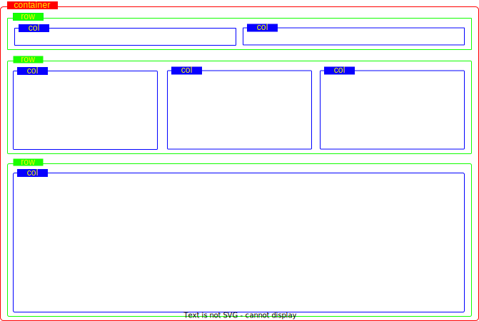
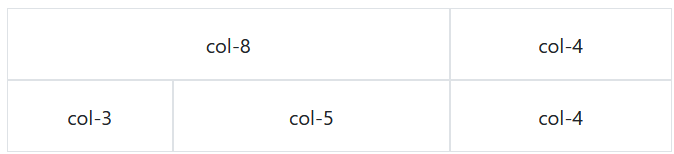

          
  

  

  
  

  <article class="gdoc-markdown gdoc-markdown__align--left">
    <h1>Bootstrap</h1>
    
<em>Bootstrap</em> est un ensemble prédéfini de classes CSS qui facilite l’organisation des éléments d’une page. Avec <em>Bootstrap</em>, on peut créer facilement les composantes habituelles d’une page web moderne (boutons, menus, caroussels d’images, etc.), modifier les éléments typographiques (titres, couleurs, listes et citations) et surtout réorganiser dynamiquement les éléments d’une page selon la taille de l’écran.

Pour utiliser <em>Bootstrap</em> dans un document HTML, il faut lui ajouter les références suivantes dans l’entête (la balise <code>&lt;head&gt;</code>):

" data-copy-feedback="Copied!" role="button" aria-label="Copy"><svg class="gdoc-icon copy"><use xlink:href="#gdoc_copy"></use></svg><svg class="gdoc-icon check hidden"><use xlink:href="#gdoc_check"></use></svg><pre tabindex="0" class="chroma"><code class="language-html" data-lang="html">&lt;link href="https://cdn.jsdelivr.net/npm/bootstrap@5.2.3/dist/css/bootstrap.min.css" rel="stylesheet"&gt;
&lt;script src="https://cdn.jsdelivr.net/npm/bootstrap@5.2.3/dist/js/bootstrap.bundle.min.js"&gt;&lt;/script&gt;
</code></pre>

    <h1 id="structure">
        Structure
        <a data-clipboard-text="http://otardi.gitlab.io/420-211/R%C3%A9vision/bootstrap/#structure" class="gdoc-page__anchor clip flex align-center" title="Anchor to: Structure" aria-label="Anchor to: Structure" href="#structure">
            <svg class="gdoc-icon gdoc_link"><use xlink:href="#gdoc_link"></use></svg>
        </a>
    </h1>

La structure d’une page en <em>Bootstrap</em> comprend trois niveaux:

<ul>
<li>Conteneurs</li>
<li>Rangées</li>
<li>Colonnes</li>
</ul>

Les conteneurs contiennent les rangées et les rangées contiennent les colonnes. Ces composantes correspondent à des classes CSS qu’on donne à des éléments <code>&lt;div&gt;</code> dans le DOM. Par exemple, pour le code HTML suivant:

<svg class="gdoc-icon copy"><use xlink:href="#gdoc_copy"></use></svg><svg class="gdoc-icon check hidden"><use xlink:href="#gdoc_check"></use></svg><pre tabindex="0" class="chroma"><code class="language-html" data-lang="html">&lt;div class="container"&gt;
    &lt;div class="row"&gt;
        &lt;div class="col"&gt;&lt;/div&gt;
        &lt;div class="col"&gt;&lt;/div&gt;
    &lt;/div&gt;
    &lt;div class="row"&gt;
        &lt;div class="col"&gt;&lt;/div&gt;
        &lt;div class="col"&gt;&lt;/div&gt;
        &lt;div class="col"&gt;&lt;/div&gt;
    &lt;/div&gt;
    &lt;div class="row"&gt;
        &lt;div class="col"&gt;&lt;/div&gt;
    &lt;/div&gt;
&lt;/div&gt;
</code></pre>

on aura la disposition suivante:

    <h2 id="container">
        <code>container</code>
        <a data-clipboard-text="http://otardi.gitlab.io/420-211/R%C3%A9vision/bootstrap/#container" class="gdoc-page__anchor clip flex align-center" title="Anchor to: container" aria-label="Anchor to: container" href="#container">
            <svg class="gdoc-icon gdoc_link"><use xlink:href="#gdoc_link"></use></svg>
        </a>
    </h2>

C’est l’élément de base. Identifié par <code>&lt;div class="container"&gt;</code>.

<ul>
<li>La classe <code>container</code> a une marge et une largeur inférieure à celle de l’écran</li>
<li>La classe <code>container-fluid</code> occupe la pleine largeur de l’écran.</li>
</ul>

En général, on utilise un seul conteneur par page.

    <h2 id="row">
        <code>row</code>
        <a data-clipboard-text="http://otardi.gitlab.io/420-211/R%C3%A9vision/bootstrap/#row" class="gdoc-page__anchor clip flex align-center" title="Anchor to: row" aria-label="Anchor to: row" href="#row">
            <svg class="gdoc-icon gdoc_link"><use xlink:href="#gdoc_link"></use></svg>
        </a>
    </h2>

Les rangées permettent de diviser l’espace d’un conteneur du haut en bas. Elles sont identifiées par <code>&lt;div class="row"&gt;</code>. On peut en mettre autant qu’on veut dans un même conteneur.

La taille verticale d’une rangée est déterminée par son contenu.

    <h2 id="column">
        <code>column</code>
        <a data-clipboard-text="http://otardi.gitlab.io/420-211/R%C3%A9vision/bootstrap/#column" class="gdoc-page__anchor clip flex align-center" title="Anchor to: column" aria-label="Anchor to: column" href="#column">
            <svg class="gdoc-icon gdoc_link"><use xlink:href="#gdoc_link"></use></svg>
        </a>
    </h2>

Les colonnes divisent de gauche à droite l’espace d’une rangée. Elles sont identifiées par <code>&lt;div class="col"&gt;</code>.

La taille horizontale d’une colonne est déterminée par le nombre total de colonnes de la rangée: donc si une rangée contient 2 colonnes, chacune occupe la moitié de l’espace; si elle en contient 3, chacune occupe un tiers de l’espace; etc.

Il est cependant possible de spécifier des proportions différentes.

    <h2 id="la-grille-bootstrap">
        La grille bootstrap
        <a data-clipboard-text="http://otardi.gitlab.io/420-211/R%C3%A9vision/bootstrap/#la-grille-bootstrap" class="gdoc-page__anchor clip flex align-center" title="Anchor to: La grille bootstrap" aria-label="Anchor to: La grille bootstrap" href="#la-grille-bootstrap">
            <svg class="gdoc-icon gdoc_link"><use xlink:href="#gdoc_link"></use></svg>
        </a>
    </h2>

Le modèle de <em>bootstrap</em> est basé sur une grille de 12 colonnes: si on veut contrôler nous-mêmes la taille des colonnes il faut ajouter un suffixe numérique d’une valeur de 1 à 12 à la classe <strong>col</strong>. Ce nombre correspond à la largeur (sur 12) que la colonne occupe dans la page. Par exemple:

<ul>
<li><code>col-1</code> a une largeur de 1/12 de la page</li>
<li><code>col-4</code> a une largeur de 4/12 (donc un tiers) de la page</li>
<li><code>col-9</code> a une largeur de 3/4 de la page</li>
<li>etc.</li>
</ul>

Lorsqu’on ne spécifie pas de taille, toute la largeur est occupée; ainsi <code>col-12</code> a le même effet que <code>col</code>.

Donc, pour la structure suivante:

<svg class="gdoc-icon copy"><use xlink:href="#gdoc_copy"></use></svg><svg class="gdoc-icon check hidden"><use xlink:href="#gdoc_check"></use></svg><pre tabindex="0" class="chroma"><code class="language-html" data-lang="html">&lt;div class="container"&gt;
    &lt;div class="row"&gt;
        &lt;div class="col-8"&gt;&lt;/div&gt;
        &lt;div class="col-4"&gt;&lt;/div&gt;
    &lt;/div&gt;
    &lt;div class="row"&gt;
        &lt;div class="col-3"&gt;&lt;/div&gt;
        &lt;div class="col-6"&gt;&lt;/div&gt;
        &lt;div class="col-3"&gt;&lt;/div&gt;
    &lt;/div&gt;
&lt;/div&gt;    
</code></pre>

on aura la disposition suivante:

<a class="gdoc-markdown__link" href="/420-211/ressources/exemple-grille.html">(exemple)</a>

    <h1 id="transitions">
        Transitions
        <a data-clipboard-text="http://otardi.gitlab.io/420-211/R%C3%A9vision/bootstrap/#transitions" class="gdoc-page__anchor clip flex align-center" title="Anchor to: Transitions" aria-label="Anchor to: Transitions" href="#transitions">
            <svg class="gdoc-icon gdoc_link"><use xlink:href="#gdoc_link"></use></svg>
        </a>
    </h1>

Afin de permettre au contenu d’une page de bien s’adapter aux différentes tailles des écrans (PC, tablette, cellulaire…), <em>bootstrap</em> définit 6 tailles d’écran possibles:

<ul>
<li><code>xs</code>: <em>extra-small</em></li>
<li><code>sm</code>: <em>small</em></li>
<li><code>md</code>: <em>medium</em></li>
<li><code>lg</code>: <em>large</em></li>
<li><code>xl</code>: <em>extra-large</em></li>
<li><code>xxl</code>: <em>extra-extra-large</em></li>
</ul>

Lorsque l’écran est redimensionné, on peut utiliser ces tailles avec les classes <strong>col</strong> pour ajuster la taille des colonnes. Par exemple <code>class="col-md-6"</code> signifie qu’on a une largeur de 6 pour les tailles <em>medium</em> et plus; les tailles inférieures, puisqu’elles ne sont pas spécifiées, occupent la pleine largeur.

Dans l’exemple suivant, 3 <strong>div</strong> ont la classe <code>col-sm-4</code>; donc, chaque <strong>div</strong> occupe un tiers (4/12) de l’espace pour la taille d’écran “small” et les tailles plus grandes:

col-sm-4</h2>
            
Cras porttitor ullamcorper diam et vulputate. Praesent non mauris nec sem consequat auctor nec vel leo. Aenean pulvinar enim ac iaculis convallis.

        

        

            <h2>col-sm-4</h2>
            
Cras porttitor ullamcorper diam et vulputate. Praesent non mauris nec sem consequat auctor nec vel leo. Aenean pulvinar enim ac iaculis convallis.

        

        

            <h2>col-sm-4</h2>
            
Cras porttitor ullamcorper dam et vulputate. Praesent non mauris nec sem consequat auctor nec vel leo. Aenean pulvinar enim ac iaculis convallis.

        

    

" data-copy-feedback="Copied!" role="button" aria-label="Copy"><svg class="gdoc-icon copy"><use xlink:href="#gdoc_copy"></use></svg><svg class="gdoc-icon check hidden"><use xlink:href="#gdoc_check"></use></svg><pre tabindex="0" class="chroma"><code class="language-html" data-lang="html">&lt;div class="container"&gt;
    &lt;div class="row"&gt;
        &lt;div class="col-sm-4"&gt;
            &lt;h2&gt;col-sm-4&lt;/h2&gt;
            &lt;p&gt;Cras porttitor ullamcorper diam et vulputate. Praesent non mauris nec sem consequat auctor nec vel leo. Aenean pulvinar enim ac iaculis convallis.&lt;/p&gt;
        &lt;/div&gt;
        &lt;div class="col-sm-4"&gt;
            &lt;h2&gt;col-sm-4&lt;/h2&gt;
            &lt;p&gt;Cras porttitor ullamcorper diam et vulputate. Praesent non mauris nec sem consequat auctor nec vel leo. Aenean pulvinar enim ac iaculis convallis.&lt;/p&gt;
        &lt;/div&gt;
        &lt;div class="col-sm-4"&gt;
            &lt;h2&gt;col-sm-4&lt;/h2&gt;
            &lt;p&gt;Cras porttitor ullamcorper dam et vulputate. Praesent non mauris nec sem consequat auctor nec vel leo. Aenean pulvinar enim ac iaculis convallis.&lt;/p&gt;
        &lt;/div&gt;
    &lt;/div&gt;
&lt;/div&gt;    
</code></pre>

<a class="gdoc-markdown__link" href="/420-211/ressources/exemple-responsive.html">(exemple)</a>

<blockquote class="gdoc-hint note">
  
<i class="fa note" title="Note"></i>

  
Puisque <code>xs</code> est la taille minimale, il n’y a pas de transition entre elle et une taille plus petite. Il est donc inutile de définir une largeur de colonne comme <code>col-xs-3</code>, puisque cela est équivalent à <code>col-3</code>.

</blockquote>

On peut définir plus d’une transition pour un même élément. Par exemple une rangée peut contenir 4 éléments pour les grandes tailles, 2 rangées de 2 éléments pour les tailles moyennes et 4 rangées de 1 élément pour les petites tailles. Pour ce fait il suffit de donner deux classes pour un même élément. L’exemple suivant illustre ceci:

Titre 1</h2>
            
Cras porttitor ullamcorper diam et vulputate. Praesent non mauris nec sem consequat auctor nec vel leo. Aenean pulvinar enim ac iaculis convallis.

        

        

            <h2>Titre 2</h2>
            
Cras porttitor ullamcorper diam et vulputate. Praesent non mauris nec sem consequat auctor nec vel leo. Aenean pulvinar enim ac iaculis convallis.

        

        

            <h2>Titre 3</h2>
            
Cras porttitor ullamcorper diam et vulputate. Praesent non mauris nec sem consequat auctor nec vel leo. Aenean pulvinar enim ac iaculis convallis.

        

        

            <h2>Titre 4</h2>
            
Cras porttitor ullamcorper diam et vulputate. Praesent non mauris nec sem consequat auctor nec vel leo. Aenean pulvinar enim ac iaculis convallis.

        

    

" data-copy-feedback="Copied!" role="button" aria-label="Copy"><svg class="gdoc-icon copy"><use xlink:href="#gdoc_copy"></use></svg><svg class="gdoc-icon check hidden"><use xlink:href="#gdoc_check"></use></svg><pre tabindex="0" class="chroma"><code class="language-html" data-lang="html">&lt;div class="container"&gt;
    &lt;div class="row"&gt;
        &lt;div class="col-sm-6 col-lg-3"&gt;
            &lt;h2&gt;Titre 1&lt;/h2&gt;
            &lt;p&gt;Cras porttitor ullamcorper diam et vulputate. Praesent non mauris nec sem consequat auctor nec vel leo. Aenean pulvinar enim ac iaculis convallis.&lt;/p&gt;
        &lt;/div&gt;
        &lt;div class="col-sm-6 col-lg-3"&gt;
            &lt;h2&gt;Titre 2&lt;/h2&gt;
            &lt;p&gt;Cras porttitor ullamcorper diam et vulputate. Praesent non mauris nec sem consequat auctor nec vel leo. Aenean pulvinar enim ac iaculis convallis.&lt;/p&gt;
        &lt;/div&gt;
        &lt;div class="col-sm-6 col-lg-3"&gt;
            &lt;h2&gt;Titre 3&lt;/h2&gt;
            &lt;p&gt;Cras porttitor ullamcorper diam et vulputate. Praesent non mauris nec sem consequat auctor nec vel leo. Aenean pulvinar enim ac iaculis convallis.&lt;/p&gt;
        &lt;/div&gt;
        &lt;div class="col-sm-6 col-lg-3"&gt;
            &lt;h2&gt;Titre 4&lt;/h2&gt;
            &lt;p&gt;Cras porttitor ullamcorper diam et vulputate. Praesent non mauris nec sem consequat auctor nec vel leo. Aenean pulvinar enim ac iaculis convallis.&lt;/p&gt;
        &lt;/div&gt;
    &lt;/div&gt;
&lt;/div&gt;    
</code></pre>

<a class="gdoc-markdown__link" href="/420-211/ressources/exemple-responsive2.html">(exemple)</a>

    <h1 id="composantes">
        Composantes
        <a data-clipboard-text="http://otardi.gitlab.io/420-211/R%C3%A9vision/bootstrap/#composantes" class="gdoc-page__anchor clip flex align-center" title="Anchor to: Composantes" aria-label="Anchor to: Composantes" href="#composantes">
            <svg class="gdoc-icon gdoc_link"><use xlink:href="#gdoc_link"></use></svg>
        </a>
    </h1>

Dans cette section nous allons voir quelques exemples des composantes et éléments de style offerts par <em>Bootstrap</em>. La liste est très courte; l’objectif ici est simplement de se faire une idée générale de la manière dont on peut utiliser les éléments de style de ce cadriciel. Au fil de la session, nous aurons l’occasion de voir d’autres éléments.

Pour plus de détails sur les composantes <em>Bootstrap</em>, vous pouvez vous référer à la documentation technique (<a class="gdoc-markdown__link" href="https://getbootstrap.com/docs/5.0/getting-started/introduction/">https://getbootstrap.com/docs/5.0/getting-started/introduction/</a>)

    <h2 id="images">
        Images
        <a data-clipboard-text="http://otardi.gitlab.io/420-211/R%C3%A9vision/bootstrap/#images" class="gdoc-page__anchor clip flex align-center" title="Anchor to: Images" aria-label="Anchor to: Images" href="#images">
            <svg class="gdoc-icon gdoc_link"><use xlink:href="#gdoc_link"></use></svg>
        </a>
    </h2>

<ul>
<li>Classe: <code>img-fluid</code></li>
<li>Élément: <code>&lt;img&gt;</code></li>
</ul>

Lorsqu’on l’ajoute à un élément <code>&lt;img&gt;</code>, la classe <code>img-fluid</code> a pour effet de redimensionner automatiquement l’image afin qu’elle soit toujours de la taille de l’élément qui la contient.

<svg class="gdoc-icon copy"><use xlink:href="#gdoc_copy"></use></svg><svg class="gdoc-icon check hidden"><use xlink:href="#gdoc_check"></use></svg><pre tabindex="0" class="chroma"><code class="language-html" data-lang="html">&lt;img class="img-fluid" src="test.png" /&gt;
</code></pre>

    <h2 id="boutons">
        Boutons
        <a data-clipboard-text="http://otardi.gitlab.io/420-211/R%C3%A9vision/bootstrap/#boutons" class="gdoc-page__anchor clip flex align-center" title="Anchor to: Boutons" aria-label="Anchor to: Boutons" href="#boutons">
            <svg class="gdoc-icon gdoc_link"><use xlink:href="#gdoc_link"></use></svg>
        </a>
    </h2>

<ul>
<li>Classe principale: <code>btn</code></li>
<li>Classes de style: <code>btn-lg</code>, <code>btn-sm</code>, <code>btn-primary</code>, <code>btn-secondary</code>, etc.</li>
<li>Éléments: <code>&lt;button&gt;</code>, <code>&lt;a&gt;</code></li>
</ul>

Bouton &quot;button&quot;</button>
<a type=&quot;button&quot; class=&quot;btn btn-primary&quot; href=&quot;#&quot;>Bouton &quot;a&quot;</a>" data-copy-feedback="Copied!" role="button" aria-label="Copy"><svg class="gdoc-icon copy"><use xlink:href="#gdoc_copy"></use></svg><svg class="gdoc-icon check hidden"><use xlink:href="#gdoc_check"></use></svg><pre tabindex="0" class="chroma"><code class="language-html" data-lang="html">&lt;button type="button" class="btn btn-primary"&gt;Bouton "button"&lt;/button&gt;
&lt;a type="button" class="btn btn-primary" href="#"&gt;Bouton "a"&lt;/a&gt;
</code></pre>

Tous les boutons doivent avoir la classe <code>btn</code>; ensuite, selon le style qu’on veut leur donner on peut attribuer des classes pour leur taille (<code>btn-lg</code>, <code>btn-sm</code>) ou pour leur couleur (<code>btn-primary</code>, <code>btn-secondary</code>).

La classe <code>active</code> accentue la couleur du bouton.

La classe <code>disabled</code> désactive le bouton. Ceci a pour effet d’atténuer sa couleur et de rendre le clic impossible.

    <h2 id="menu">
        Menu
        <a data-clipboard-text="http://otardi.gitlab.io/420-211/R%C3%A9vision/bootstrap/#menu" class="gdoc-page__anchor clip flex align-center" title="Anchor to: Menu" aria-label="Anchor to: Menu" href="#menu">
            <svg class="gdoc-icon gdoc_link"><use xlink:href="#gdoc_link"></use></svg>
        </a>
    </h2>

<ul>
<li>Classes: <code>nav</code>, <code>nav-item</code>, <code>nav-link</code></li>
<li>Éléments: <code>&lt;ul&gt;</code>, <code>&lt;li&gt;</code></li>
</ul>

    <li class=&quot;nav-item&quot;>
        <a class=&quot;nav-link&quot; href=&quot;#&quot;>Item 1</a> 
    </li>
    <li class=&quot;nav-item&quot;>
        <a class=&quot;nav-link&quot; href=&quot;#&quot;>Item 2</a> 
    </li>
</ul>" data-copy-feedback="Copied!" role="button" aria-label="Copy"><svg class="gdoc-icon copy"><use xlink:href="#gdoc_copy"></use></svg><svg class="gdoc-icon check hidden"><use xlink:href="#gdoc_check"></use></svg><pre tabindex="0" class="chroma"><code class="language-html" data-lang="html">&lt;ul class="nav"&gt;
    &lt;li class="nav-item"&gt;
        &lt;a class="nav-link" href="#"&gt;Item 1&lt;/a&gt; 
    &lt;/li&gt;
    &lt;li class="nav-item"&gt;
        &lt;a class="nav-link" href="#"&gt;Item 2&lt;/a&gt; 
    &lt;/li&gt;
&lt;/ul&gt;
</code></pre>

L’élément parent d’un menu est <code>&lt;ul&gt;</code> et on doit lui donner la classe <code>nav</code>; chaque item du menu correspond à un sous-élément <code>&lt;li&gt;</code> qui doit avoir la classe <code>nav-item</code> et le lien <code>&lt;a&gt;</code> vers la page de destination doit avoir la classe <code>nav-link</code>.

Comme pour les boutons, la classe <code>active</code> accentue la couleur de l’item du menu, et la classe <code>disabled</code> désactive l’item du menu.

<blockquote class="gdoc-hint tip">
  
<i class="fa tip" title="Remarque"></i>

  
Ces classes permettent de créer des menus simples. La classe <code>navbar</code>, plus flexible mais plus complexe, donne accès à des fonctionnalités de menu plus élaborées.

</blockquote>

    <h2 id="cards">
        Cards
        <a data-clipboard-text="http://otardi.gitlab.io/420-211/R%C3%A9vision/bootstrap/#cards" class="gdoc-page__anchor clip flex align-center" title="Anchor to: Cards" aria-label="Anchor to: Cards" href="#cards">
            <svg class="gdoc-icon gdoc_link"><use xlink:href="#gdoc_link"></use></svg>
        </a>
    </h2>

<ul>
<li>Classes principales: <code>card</code>, <code>card-body</code>, <code>card-title</code>, <code>card-text</code></li>
<li>Classes secondaires: <code>card-header</code>, <code>card-footer</code>, <code>card-img-top</code>, etc.</li>
</ul>

Les “cartes” sont un type de conteneur simple qui permet de regrouper dans un petit espace des informations de toutes sortes. Elles ont une bordure par défaut et peuvent contenir des images, des titres, du texte, des boutons, etc.

Le format minimal de carte (qui contient uniquement du texte) contient deux <code>&lt;div&gt;</code> imbriqués; le parent a la classe <code>card</code> et l’enfant a la classe <code>card-body</code>:

<svg class="gdoc-icon copy"><use xlink:href="#gdoc_copy"></use></svg><svg class="gdoc-icon check hidden"><use xlink:href="#gdoc_check"></use></svg><pre tabindex="0" class="chroma"><code class="language-html" data-lang="html">&lt;div class="card"&gt;
    &lt;div class="card-body"&gt;
        &lt;p&gt;Texte de la carte&lt;/p&gt;
    &lt;/div&gt;
&lt;/div&gt;
</code></pre>

Pour ajouter une image à la carte, on utilise un élément <code>&lt;img&gt;</code>. Celui-ci doit avoir <code>card</code> comme parent immédiat.

Le code suivant montre un exemple de carte plus complexe qui comprend une entête et un pied, une image, un titre et du contenu texte:

Titre de la carte</h5>
        
Texte de la carte

    

    

        Pied
    

" data-copy-feedback="Copied!" role="button" aria-label="Copy"><svg class="gdoc-icon copy"><use xlink:href="#gdoc_copy"></use></svg><svg class="gdoc-icon check hidden"><use xlink:href="#gdoc_check"></use></svg><pre tabindex="0" class="chroma"><code class="language-html" data-lang="html">&lt;div class="card"&gt;
    &lt;div class="card-header p-3"&gt;
        Entête
    &lt;/div&gt;
    &lt;img src="patate.png" /&gt;
    &lt;div class="card-body text-center"&gt;
        &lt;h5 class="card-title"&gt;Titre de la carte&lt;/h5&gt;
        &lt;p class="card-text"&gt;Texte de la carte&lt;/p&gt;
    &lt;/div&gt;
    &lt;div class="card-footer"&gt;
        Pied
    &lt;/div&gt;
&lt;/div&gt;
</code></pre>

<a class="gdoc-markdown__link" href="/420-211/ressources/card1.html">(exemple)</a>

  </article>

