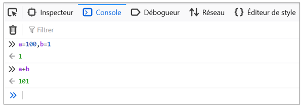
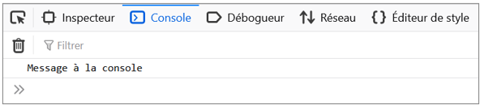
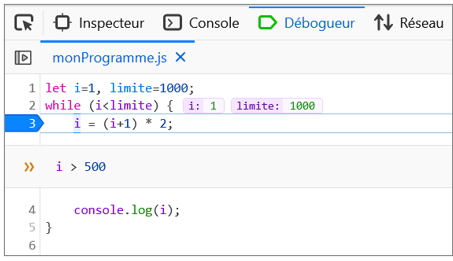

<article class="gdoc-markdown gdoc-markdown__align--left">
<h1>Débogage JS</h1>

<h2 id="exécution-de-scripts-js">
Exécution de scripts JS
<a data-clipboard-text="http://otardi.gitlab.io/420-211/R%C3%A9vision/outils/#exécution-de-scripts-js" class="gdoc-page__anchor clip flex align-center" title="Anchor to: Exécution de scripts JS" aria-label="Anchor to: Exécution de scripts JS" href="#ex%c3%a9cution-de-scripts-js">
<svg class="gdoc-icon gdoc_link"><use xlink:href="#gdoc_link"></use></svg>
</a>
</h2>

Javascript est un langage qui s’exécute dans le navigateur. Les programmes JS peuvent être directement inclus dans des balises HTML <code>&lt;script&gt;</code>, comme suit:

<em><strong>index.html</strong></em>

<html>
<head>

</head>
<body></body>
</html>" data-copy-feedback="Copied!" role="button" aria-label="Copy"><svg class="gdoc-icon copy"><use xlink:href="#gdoc_copy"></use></svg><svg class="gdoc-icon check hidden"><use xlink:href="#gdoc_check"></use></svg><pre tabindex="0" class="chroma"><code class="language-html" data-lang="html">&lt;!DOCTYPE html&gt;
&lt;html&gt;
    &lt;head&gt;
        &lt;script&gt;
            alert("ceci est un message");
        &lt;/script&gt;
    &lt;/head&gt;
    &lt;body&gt;&lt;/body&gt;
&lt;/html&gt;
</code></pre>

ou encore inclus comme des fichiers qu’on désigne en utilisant l’attribut <code>src</code> de l’élément <code>&lt;script&gt;</code>:

<em><strong>index.html</strong></em>

<html>
<head>

</head>
<body></body>
</html>" data-copy-feedback="Copied!" role="button" aria-label="Copy"><svg class="gdoc-icon copy"><use xlink:href="#gdoc_copy"></use></svg><svg class="gdoc-icon check hidden"><use xlink:href="#gdoc_check"></use></svg><pre tabindex="0" class="chroma"><code class="language-html" data-lang="html">&lt;!DOCTYPE html&gt;
&lt;html&gt;
    &lt;head&gt;
        &lt;script src="monProgramme.js"&gt;&lt;/script&gt;
    &lt;/head&gt;
    &lt;body&gt;&lt;/body&gt;
&lt;/html&gt;
</code></pre>

<em><strong>monProgramme.js</strong></em>

<svg class="gdoc-icon copy"><use xlink:href="#gdoc_copy"></use></svg><svg class="gdoc-icon check hidden"><use xlink:href="#gdoc_check"></use></svg><pre tabindex="0" class="chroma"><code class="language-js" data-lang="js">alert("ceci est un message")
</code></pre>

<h2 id="outils-de-développement">
Outils de développement
<a data-clipboard-text="http://otardi.gitlab.io/420-211/R%C3%A9vision/outils/#outils-de-développement" class="gdoc-page__anchor clip flex align-center" title="Anchor to: Outils de développement" aria-label="Anchor to: Outils de développement" href="#outils-de-d%c3%a9veloppement">
<svg class="gdoc-icon gdoc_link"><use xlink:href="#gdoc_link"></use></svg>
</a>
</h2>

Dans ce cours nous utiliserons les outils de développement de <em>Firefox</em>. Pour y accéder, faites <code>CTRL-Maj-I</code> dans le navigateur.

<h3 id="console">
Console
<a data-clipboard-text="http://otardi.gitlab.io/420-211/R%C3%A9vision/outils/#console" class="gdoc-page__anchor clip flex align-center" title="Anchor to: Console" aria-label="Anchor to: Console" href="#console">
<svg class="gdoc-icon gdoc_link"><use xlink:href="#gdoc_link"></use></svg>
</a>
</h3>

La console permet d’évaluer directement des expressions en JS ou encore d’afficher des messages à partir d’un programme.

Pour évaluer des expressions il suffit de les taper sur la ligne de commande :

Pour afficher des messages à partir d’un programme il faut utiliser <code>console.log()</code> dans le programme, comme ceci:

<em><strong>monProgramme.js:</strong></em>

<svg class="gdoc-icon copy"><use xlink:href="#gdoc_copy"></use></svg><svg class="gdoc-icon check hidden"><use xlink:href="#gdoc_check"></use></svg><pre tabindex="0" class="chroma"><code class="language-js" data-lang="js">console.log("Message à la console");
</code></pre>

Au chargement de la page (et donc, de l’exécution du script JS), on verra le message apparaître:

<h3 id="débogueur">
Débogueur
<a data-clipboard-text="http://otardi.gitlab.io/420-211/R%C3%A9vision/outils/#débogueur" class="gdoc-page__anchor clip flex align-center" title="Anchor to: Débogueur" aria-label="Anchor to: Débogueur" href="#d%c3%a9bogueur">
<svg class="gdoc-icon gdoc_link"><use xlink:href="#gdoc_link"></use></svg>
</a>
</h3>

Les outils de développement de Firefox incluent un débogueur; parmi ses fonctionnalités il y a les <em><strong>points d’arrêt</strong></em> qui permettent de suspendre le flot d’exécution du programme et d’y inspecter les valeurs des variables. Ceci est très utile pour de détecter la cause des erreurs qui apparaissent au moment de l’exécution.

Pour mettre en pause un programme lorsqu’il arrive à une instruction donnée, il suffit de cliquer sur la marge de la ligne correspondante, ce qui crée un point d’arrêt (représenté par un marqueur bleu). Lors du rechargement de la page, l’exécution sera suspendue à cet endroit et les valeurs des variables (ici, <code>i: 1</code> et <code>limite: 1000</code>) seront affichées:

<ul>
<li>La touche <strong>F10</strong> permet de passer à la prochaine instruction et ainsi de poursuivre ligne par ligne l’exécution du programme.</li>
<li>La touche <strong>F8</strong> continue l’exécution du programme. Évidemment, puisqu’ici le point d’arrêt est dans une boucle, le programme sera de nouveau suspendu à la prochaine itération.</li>
</ul>

Il est possible d’associer des <em>conditions</em> aux points d’arrêt afin que le programme s’arrête seulement lorsque les variables ont une valeur spécifique. Pour ce faire il faut se placer sur la ligne du point d’arrêt et faire <code>CTRL-Maj-B</code>, puis définir la condition:

Les points d’arrêt conditionnels sont identifiés par un marqueur <strong>jaune</strong>.

</article>

